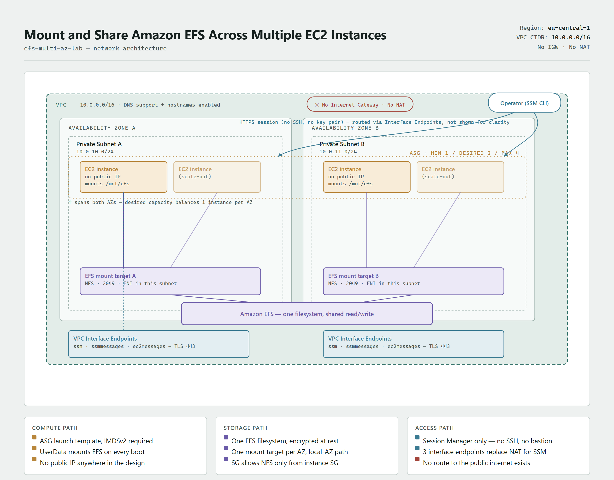

# Mount and Share Amazon EFS Across Multiple EC2 Instances

**Author:** Eric Obeng
**Lab:** EFS Multi-AZ Auto Scaling Lab
**Region:** eu-central-1

## Architecture

A highly available Auto Scaling Group of EC2 instances, spread across two
private subnets in two AZs, all mounting the same Amazon EFS filesystem on
boot. There is no Internet Gateway, no NAT Gateway, and no public subnet
anywhere in this design - instances are reachable only via AWS Systems
Manager Session Manager, and reach SSM/EFS entirely through VPC Interface
Endpoints and mount targets inside the VPC.

This reuses the private-subnet-only, VPC-endpoint networking pattern from
the `secure-cicd-ecs-lab` in this repo, trimmed down (no public
subnets/ALB needed here) and re-pointed at SSM instead of ECR/Logs.

## Architecture diagram



Covers the VPC, both AZs' private subnets, the ASG boundary, the shared EFS
filesystem and its per-AZ mount targets, the SSM interface endpoints, and
the SSM-only access path. Source is an HTML/SVG page, exported to PNG via
headless Chrome (`chrome --headless --screenshot`) rather than the Python
`diagrams` library `secure-cicd-ecs-lab` uses - functionally equivalent
diagram-as-code, just a different renderer.

## Repo layout

```text
efs-multi-az-lab/
├── infrastructure/                        CloudFormation templates (one stack per file)
│   ├── network.yaml                       VPC, 2 private subnets, SSM VPC endpoints
│   ├── security-groups.yaml               Instance SG + EFS SG (least-privilege NFS)
│   ├── efs.yaml                           EFS filesystem + 2 mount targets (one per AZ)
│   ├── iam.yaml                           Instance role/profile (AmazonSSMManagedInstanceCore)
│   ├── asg.yaml                           Launch template (mounts EFS via UserData) + ASG
│   └── *-deployment.yaml                  GitSync per-stack parameter files
└── README.md
```

## Deploy order

Stacks depend on each other via `Fn::ImportValue`/`Export`, so they must be
deployed (or Git-synced) in this order:

1. `network.yaml` -> `efs-lab-network`
2. `security-groups.yaml` -> `efs-lab-security`
3. `efs.yaml` -> `efs-lab-efs`
4. `iam.yaml` -> `efs-lab-iam` (requires `CAPABILITY_NAMED_IAM` - the role has an explicit `RoleName`)
5. `asg.yaml` -> `efs-lab-asg`

```bash
aws cloudformation deploy --template-file infrastructure/network.yaml --stack-name efs-lab-network --region eu-central-1
aws cloudformation deploy --template-file infrastructure/security-groups.yaml --stack-name efs-lab-security --region eu-central-1
aws cloudformation deploy --template-file infrastructure/efs.yaml --stack-name efs-lab-efs --region eu-central-1
aws cloudformation deploy --template-file infrastructure/iam.yaml --stack-name efs-lab-iam --region eu-central-1 --capabilities CAPABILITY_NAMED_IAM
aws cloudformation deploy --template-file infrastructure/asg.yaml --stack-name efs-lab-asg --region eu-central-1
```

Note: the `--stack-name` above (`efs-lab-*`) is just the CloudFormation stack's own name - it's
independent from the `LabName` parameter each template uses to name/tag its actual resources
(default `efs-multi-az-lab`). Deploying with no `--parameter-overrides`, as above, means the real
resources are named `efs-multi-az-lab-vpc`, `efs-multi-az-lab-asg`, etc. - not `efs-lab-*`. Look up
the ASG by its `LabName`-based name, not the stack name, when running `aws autoscaling` commands.

## Key design decisions

- **No NAT Gateway, no Internet Gateway.** Instances in the private subnets
  reach SSM entirely through 3 VPC Interface Endpoints (`ssm`,
  `ssmmessages`, `ec2messages`). EFS mount traffic never leaves the VPC -
  it goes directly to the mount target ENI's private IP in the same AZ.
- **S3 Gateway Endpoint (free) for `dnf`.** Amazon Linux 2023's package
  repos are themselves hosted behind an S3 bucket
  (`al2023-repos-<region>-*.s3...`). Without this endpoint, `dnf install
  amazon-efs-utils` in UserData has no path to S3 with no IGW/NAT, times
  out after ~30s per repo, and silently aborts the rest of the mount
  script - discovered live when the first two instances came up with no
  `/mnt/efs` at all. Same category of gotcha as the ECR/S3 dependency in
  `secure-cicd-ecs-lab`, just a different AWS service hiding behind S3.
- **Least privilege security groups.** The EFS security group's only
  ingress rule references the instance security group _by ID_, not by
  CIDR - only traffic that is actually an ASG instance can ever reach the
  filesystem on port 2049.
- **IMDSv2 required** (`HttpTokens: required`) on the launch template as a
  baseline EC2 hardening step.
- **UserData mounts EFS on every boot**, not just first boot - this means
  ASG scale-out events (e.g. desired capacity increasing under load) mount
  the shared filesystem automatically with zero manual steps, which is
  what makes "any instance can read/write the same files" actually hold
  under scaling.
- **SSM-only access.** No key pair, no SSH security group rule exists
  anywhere in this design - the only way to reach an instance is
  `aws ssm start-session`.

## Validating the lab

Validated live on 2026-08-04: instance in `eu-central-1a` wrote a file to
`/mnt/efs`, and the instance in `eu-central-1b` read it back and appended
its own line - confirming shared read/write across AZs with no manual
mount step (both instances auto-mounted via UserData on boot).

Connect to an instance via Session Manager (no SSH, no public IP):

```bash
aws ssm start-session --target <instance-id> --region eu-central-1
```

On the instance, confirm the mount and write a file:

```bash
df -h /mnt/efs
echo "hello from $(hostname)" | sudo tee /mnt/efs/test.txt
```

Connect to a **different** instance in the ASG (different AZ) and confirm
the file is visible - this is the cross-instance file visibility rubric
item:

```bash
cat /mnt/efs/test.txt
```

## Teardown (avoid ongoing charges)

Main cost drivers: the running EC2 instances (hourly) and the 3 VPC
Interface Endpoints (each billed hourly). EFS storage itself is billed
per-GB and is cheap at lab scale.

**Disable GitSync on every stack before deleting anything** (console ->
Stack -> Git sync tab -> Disable). If GitSync is still connected when you
call `delete-stack`, it detects "drift" against the template in git and
silently reverts the delete back to `UPDATE_COMPLETE` instead of actually
deleting - see the teardown notes in `secure-cicd-ecs-lab/README.md` for
the full story on this failure mode.

Delete stacks in **reverse** of the deploy order, waiting for each to
finish before starting the next:

```bash
aws cloudformation delete-stack --stack-name efs-lab-asg --region eu-central-1
aws cloudformation wait stack-delete-complete --stack-name efs-lab-asg --region eu-central-1

aws cloudformation delete-stack --stack-name efs-lab-iam --region eu-central-1
aws cloudformation wait stack-delete-complete --stack-name efs-lab-iam --region eu-central-1

aws cloudformation delete-stack --stack-name efs-lab-efs --region eu-central-1
aws cloudformation wait stack-delete-complete --stack-name efs-lab-efs --region eu-central-1

aws cloudformation delete-stack --stack-name efs-lab-security --region eu-central-1
aws cloudformation wait stack-delete-complete --stack-name efs-lab-security --region eu-central-1

aws cloudformation delete-stack --stack-name efs-lab-network --region eu-central-1
aws cloudformation wait stack-delete-complete --stack-name efs-lab-network --region eu-central-1
```

Unlike the ECS lab, there is no S3 bucket or ECR repo to empty manually
here - `efs.yaml`'s mount targets are deleted automatically by
CloudFormation as part of deleting that stack, before the filesystem
itself is removed.

## Still to do

- [x] Architecture diagram (see "Architecture diagram" above)
- [x] Live validation per the "Validating the lab" section above
- [ ] Enable GitSync on all 5 stacks, connected to `main`
