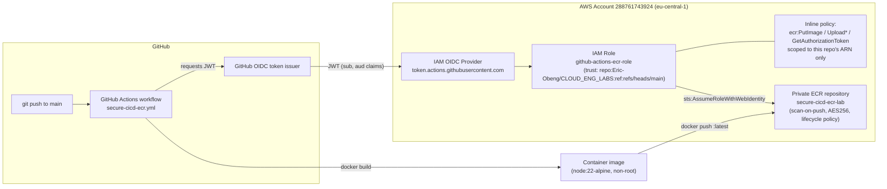

# Secure CI/CD Pipeline for Amazon ECR

**Author:** Eric Obeng
**Lab:** Secure CI/CD Pipeline for Containerized Applications Using GitHub Actions and Amazon ECR
**Region:** eu-central-1

## Overview

A Node.js/Express app is containerized and pushed to a private Amazon ECR
repository by a GitHub Actions workflow. The workflow authenticates to AWS
using GitHub's OIDC provider and a short-lived, repo-and-branch-scoped IAM
role - no AWS access keys are stored in GitHub at any point.

## Architecture diagram



The trust policy's `Condition` block checks the JWT's `sub` claim exactly
matches `repo:Eric-Obeng/CLOUD_ENG_LABS:ref:refs/heads/main`, so no other
GitHub repo or branch can assume this role even if it knew the role ARN.
The inline ECR policy is scoped to this lab's repository ARN only
(`ecr:GetAuthorizationToken` is the one exception - it's a token endpoint
with no per-repo ARN in the API).

## Repo layout

```text
secure-cicd-ecr-lab/
├── src/app.js                              Express app (/  and /health)
├── Dockerfile                              Multi-stage, node:22-alpine, non-root USER node
├── .dockerignore
├── infrastructure/
│   ├── ecr.yml                             Private ECR repo (scan-on-push, AES256, lifecycle policy)
│   ├── pipeline.yml                        GitHub OIDC provider ref + least-privilege IAM role
│   └── *-deployment.yml                    GitSync per-stack parameter files
└── README.md

.github/workflows/secure-cicd-ecr.yml       GitHub Actions workflow (must live at repo root)
```

## Deploy order

`pipeline.yml` imports the ECR repository ARN exported by `ecr.yml`, so
`ecr.yml` must be deployed first.

1. `infrastructure/ecr.yml` -> exports `secure-cicd-ecr-lab-EcrRepositoryArn`
2. `infrastructure/pipeline.yml` -> creates `github-actions-ecr-role`
   (requires `CAPABILITY_NAMED_IAM` since the role has an explicit `RoleName`)

```bash
aws cloudformation deploy \
  --template-file infrastructure/ecr.yml \
  --stack-name secure-cicd-ecr-lab-ecr \
  --region eu-central-1

aws cloudformation deploy \
  --template-file infrastructure/pipeline.yml \
  --stack-name secure-cicd-ecr-lab-pipeline \
  --region eu-central-1 \
  --capabilities CAPABILITY_NAMED_IAM
```

> If `github-actions-ecr-role` already exists in the account (e.g. created
> manually before this template existed), delete it first - IAM role names
> are unique per account and CloudFormation will fail to create a duplicate.

## CI/CD workflow

[.github/workflows/secure-cicd-ecr.yml](../.github/workflows/secure-cicd-ecr.yml)
triggers on every push to `main` under this lab's path, assumes
`github-actions-ecr-role` via OIDC, builds the Docker image, and pushes it
tagged `:latest` to the private ECR repository. `set -euo pipefail` in the
build/push steps ensures the job fails immediately (and the pipeline stops)
on any error rather than continuing silently.

## Deliverables

- GitHub repository: https://github.com/Eric-Obeng/CLOUD_ENG_LABS
- Private ECR repository: `secure-cicd-ecr-lab` (account `288761743924`, region `eu-central-1`)
