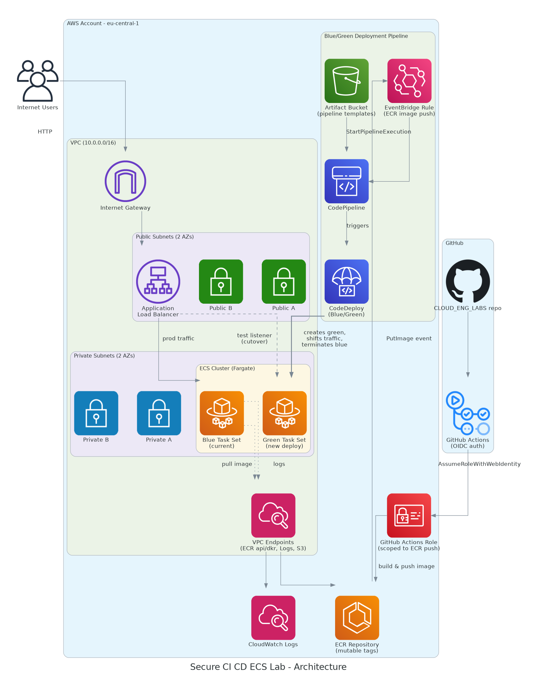

# Secure CI/CD ECS Lab

**Author:** Eric Obeng
**Lab:** Secure CI/CD ECS Lab
**Region:** eu-central-1

## Architecture



A Node/Express app runs on ECS Fargate behind a public Application Load
Balancer, inside a custom multi-AZ VPC. ECS tasks run in private subnets
with no NAT Gateway - all connectivity to ECR and CloudWatch Logs happens
through VPC Interface/Gateway Endpoints. GitHub Actions builds and pushes
container images to ECR using OIDC (no stored AWS credentials). An
EventBridge rule detects new image pushes and triggers a CodePipeline that
performs a CodeDeploy blue/green deployment to the ECS service.

## Repo layout

```
secure-cicd-ecs-lab/
├── infrastructure/                  CloudFormation templates (one stack per file)
│   ├── network.yaml                 VPC, subnets, route tables, VPC endpoints
│   ├── security-groups.yaml         ALB SG + ECS task SG (least privilege chain)
│   ├── ecr.yaml                     ECR repo, mutable tagging, lifecycle policy
│   ├── alb.yaml                     ALB, blue/green target groups, listeners
│   ├── ecs.yaml                     ECS cluster, task def, service, auto scaling
│   ├── github-oidc.yaml             GitHub OIDC IAM role (scoped to ECR push)
│   ├── codedeploy.yaml              CodeDeploy application + deployment group
│   ├── pipeline.yaml                Artifact S3 bucket + CodePipeline
│   ├── eventbridge.yaml             EventBridge rule: ECR push -> pipeline trigger
│   └── pipeline-templates/
│       ├── appspec.yaml             CodeDeploy appspec (blue/green swap config)
│       └── taskdef.json             Task definition template (image placeholder)
├── application/                     Node/Express app + Dockerfile
└── .github/workflows/
    └── build-and-push.yml           Builds + pushes image to ECR via OIDC
```

## Deploy order

Stacks have cross-stack dependencies via `Fn::ImportValue`/`Export`, so they
must be deployed (or Git-synced) in this order:

1. `network.yaml` -> `secure-cicd-network`
2. `security-groups.yaml` -> `secure-cicd-security`
3. `ecr.yaml` -> `secure-cicd-ecr`
4. `alb.yaml` -> `secure-cicd-alb`
5. `ecs.yaml` -> `secure-cicd-ecs` (requires `CAPABILITY_NAMED_IAM`)
6. `github-oidc.yaml` -> `secure-cicd-github-oidc` (requires `CAPABILITY_NAMED_IAM`)
7. `codedeploy.yaml` -> `secure-cicd-codedeploy` (requires `CAPABILITY_NAMED_IAM`)
8. `pipeline.yaml` -> `secure-cicd-pipeline` (requires `CAPABILITY_NAMED_IAM`)
9. `eventbridge.yaml` -> `secure-cicd-eventbridge` (requires `CAPABILITY_NAMED_IAM`)

## Key design decisions

- **No NAT Gateway.** ECS tasks in private subnets reach ECR (api + dkr) and
  CloudWatch Logs entirely through VPC Interface Endpoints, plus an S3
  Gateway Endpoint (ECR stores image layers in S3). This is both a cost
  optimization and a security improvement - private subnets have zero route
  to the public internet.
- **Least privilege security groups.** The ECS task security group's only
  ingress rule references the ALB security group _by ID_, not by CIDR -
  meaning only traffic that physically passed through the ALB can ever
  reach a task.
- **OIDC for GitHub Actions.** No long-lived AWS credentials are stored in
  GitHub. The workflow assumes a role scoped to exactly one repo/branch and
  exactly one ECR repository's push actions.
- **Mutable tagging strategy.** Every image push produces both a unique
  `sha-<short-sha>` tag and a floating `latest` tag. CodeDeploy's task
  definition template always deploys via the specific sha tag, so "what's
  actually running" is never ambiguous even though the repository allows
  mutable tags.
- **Blue/Green via CodeDeploy.** `DeploymentController: CODE_DEPLOY` on the
  ECS service hands all deployment orchestration to CodeDeploy: it creates a
  parallel "green" task set, shifts ALB traffic once green passes health
  checks, waits 5 minutes, then terminates "blue."

## Important gotcha: CloudFormation + CodeDeploy-controlled ECS services

Once an ECS service's `DeploymentController` is set to `CODE_DEPLOY`,
**CloudFormation must never again attempt to update that service's
`TaskDefinition` or `LoadBalancers` properties** - ECS rejects such updates
outright ("Unable to update task definition on services with a CODE_DEPLOY
deployment controller"). This has two consequences:

1. `DeploymentController` itself cannot be changed on an existing service at
   all (not even via a CloudFormation replacement) - switching a service
   from the default rolling-update controller to `CODE_DEPLOY` requires
   deleting and recreating the service.
2. The `ContainerImage` parameter in `ecs.yaml` must remain pinned to
   whatever value CloudFormation _itself_ last used to create/update the
   stack - not whatever CodeDeploy has since deployed. If the parameter's
   default value ever drifts from what CloudFormation last recorded, the
   next `UpdateStack` (including a GitSync auto-sync) will attempt to
   register a new task definition and call `ecs:UpdateService`, which ECS
   will reject. Keeping this value frozen means CloudFormation always sees
   "no changes" on this parameter and never conflicts with CodeDeploy's
   ownership of the live deployment.

## CloudFormation GitSync

GitSync is enabled on all 9 stacks, connected to the `main` branch of this
repository via CodeConnections, using a custom IAM role (`CloudFormation-role`).

**Note on `CloudFormation-role` permissions:** getting GitSync functional in
this sandbox AWS account required broader permissions than a typical
least-privilege setup, for two sandbox-specific reasons:

1. GitSync's underlying sync mechanism initially failed with a
   `iam:PassRole` error referencing
   `AWSServiceRoleForCloudFormationStackSetsOrgMember` - a service-linked
   role that can only be created via
   `organizations:EnableAWSServiceAccess` at the AWS Organizations
   management-account level. This sandbox account does not have that
   permission (`AccessDeniedException` confirmed). Creating a custom IAM
   role and attaching `AdministratorAccess` unblocked this - the exact
   mechanism by which this happens was not fully diagnosed, since it
   sits inside AWS's internal CodeConnections/GitSync service
   implementation rather than anything user-configurable.
2. The custom role's trust policy needed `cloudformation.sync.codeconnections.amazonaws.com`
   added as a trusted principal (in addition to `cloudformation.amazonaws.com`),
   and needed `events:PutRule`/`events:PutTargets`/`events:DescribeRule` and
   broad `cloudformation:*`/service-level permissions across every resource
   type used by the 9 stacks (EC2, ECS, ELB, IAM, CodeDeploy, CodePipeline,
   EventBridge, S3).

Given the number of distinct AWS services spanned by these 9 stacks, and
that this is a personal sandbox (not shared production infrastructure),
`AdministratorAccess` was attached to `CloudFormation-role` as a pragmatic
choice, rather than chasing each service's specific action list
individually. This is a deliberate trade-off distinct from the actual
workload's security posture, which follows least privilege throughout (see
above) - the deployment mechanism's permissions and the running
application's permissions are two different trust boundaries, and only the
former was relaxed here, for sandbox-practicality reasons.

## Deliverables

- Infrastructure repo: this repository, `secure-cicd-ecs-lab/infrastructure/`
- Application repo: this repository, `secure-cicd-ecs-lab/application/`
- ALB endpoint: see CloudFormation stack `secure-cicd-alb` output `AlbDnsName`
- Architecture diagram: `architecture-diagram.png` (generated via
  `architecture-diagram.py` using the Python `diagrams` library - diagram
  as code)
